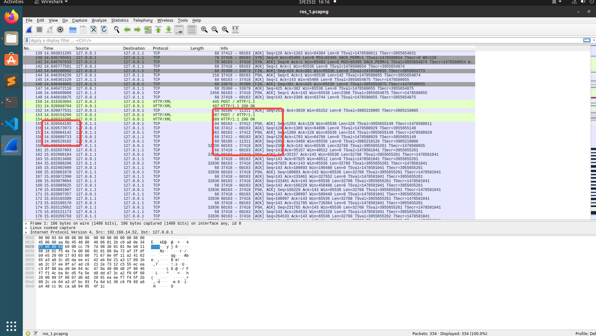
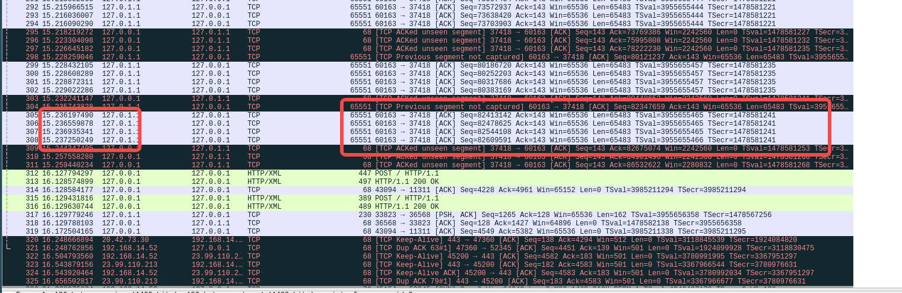

# master分支进行用于protobuf的点云回环实验（仅仅分析序列化的效率）
# 实验环境

``` shell
# 安装docker 建议学会自己搭建翻墙节点 docker安装要这个
sudo apt install curl
curl -fsSL https://test.docker.com -o test-docker.sh
sudo sh test-docker.sh
# 用户添加到组
sudo groupadd docker
sudo usermod -aG docker ${USER}
sudo systemctl restart docker
newgrp docker
docker ps 
# 路径找到.dockerfile文件
cd ~/work/ros_protobuf_msg/docker/build
# 构建docker环境
docker build --network host -t ros_protobuf:noetic  -f ros_x86.dockerfile .
# 构建好后 查看镜像
docker images
```

进行操作
```shell
# 所有操作都在docker下面 
# 进入docker环境 
./ros_docker_into.sh
# 如果不能进入就重启dokcer 
./ros_docker_run.sh

# docker环境默认的是/work
mkdir build
cd build 
cmake ..
make
```
# wireshark

any中筛选 tcp.port == 11311 || (tcp.port >= 10000 && tcp.port <= 60000)



重点查找11311后面的几个

查找发送结束时间后的

# 回环测试

## 测试了80MB点云的传输，记录结果在result中
```
roscore 
先运行rosrun excavator_extension ros_listener
再运行rosrun excavator_extension ros_talker
```
代码我是配置了的 只发送一次消息 不然单次测试很容易时间冲突 我不认为频繁发送可以省力 因为准确性差很多

ros1  15.03262   15.23725   100 

ros2  4.25156   4.48773     229

ros3  10.04962   10.30280   348

ros4  40.02516   40.25408   215

ros5  3.24825    3.48520    276

ros6  7.50338    7.84871    192

ros7  8.41122    8.76100    151

ros8  17.01864   17.41622   136

ros9  7.27992   7.69316     185

ros10 4.13653   4.52559     228

pb1  16.25513  16.38926     250

pb2  7.89066    8.09027     161

pb3  20.59848  20.74754     364

pb4  8.29644    8.43735     484

pb5  12.87856    13.06321   167

pb6  12.10790    12.29496   179

pb7  11.49228    11.62716   355

pb8  14.04060    14.20237   261

pb9  7.30273     7.53061    210

pb10 7.20709     7.46043    96

## 测试了200MB点云的传输，记录结果在result中
